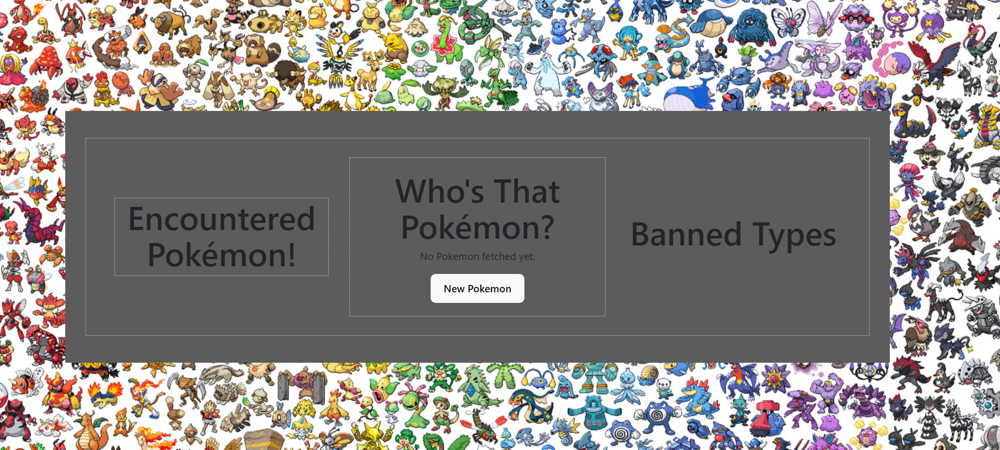
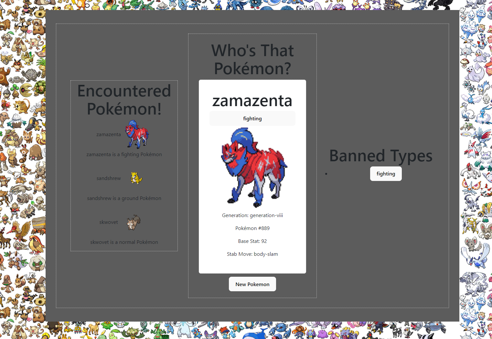
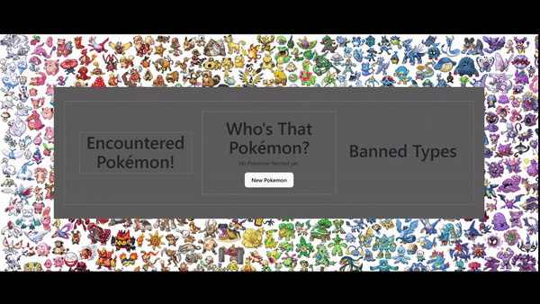

# Web Development Project 4 - Pokémon Info!

Submitted by: **Loyd Flores**

This web app: **Welcome to our Pokémon Encounter App! With this fun and interactive web app, you can embark on a journey to discover new Pokémon. Click 'New Pokemon' to randomly encounter and learn about different Pokémon. Keep track of all the Pokémon you've encountered in the 'Encountered Pokemon' section. Add extra filtering by banning specific types. Enjoy the excitement of discovering and collecting these iconic creatures from the Pokémon world!**

Time spent: **8** hours spent in total

## Required Features

The following **required** functionality is completed:

- [✔️] **Clicking a button creates a new API fetch request and displays at least three attributes from the returned JSON data**
- [✔️] **Only one item/API call is viewable at a time**
- [✔️] **API calls appear random to the user**
- [✔️] **At least one image is displayed per API call**
- [✔️]**Clicking on a displayed value for one attribute adds it to a displayed ban list**
- [✔️]**Attributes on the ban list prevent further images/API results with that attribute from being displayed**

The following **optional** features are implemented:

- [✔️] Multiple types of attributes can be added to the ban list
- [✔️] Users can see a stored history of their previously viewed items from their session

The following **additional** features are implemented:

- [✔️] Bootstrap Styling
- [✔️] Mobile Friendly
- [✔️] Favicon and Website name + Background

## Snippets

## Video Walkthrough

Here's the walkthrough link:
[Watch the Video](https://clipchamp.com/watch/Wr7sB5ZxXDd)

<!-- Replace this with whatever GIF tool you used! -->

GIF created with ...

- Microsoft Clipchamp

## Notes

Describe any challenges encountered while building the app.

## License

    Copyright 2023 Loyd Flores
    Licensed under the Apache License, Version 2.0 (the "License");
    you may not use this file except in compliance with the License.
    You may obtain a copy of the License at

        http://www.apache.org/licenses/LICENSE-2.0

    Unless required by applicable law or agreed to in writing, software
    distributed under the License is distributed on an "AS IS" BASIS,
    WITHOUT WARRANTIES OR CONDITIONS OF ANY KIND, either express or implied.
    See the License for the specific language governing permissions and
    limitations under the License.
